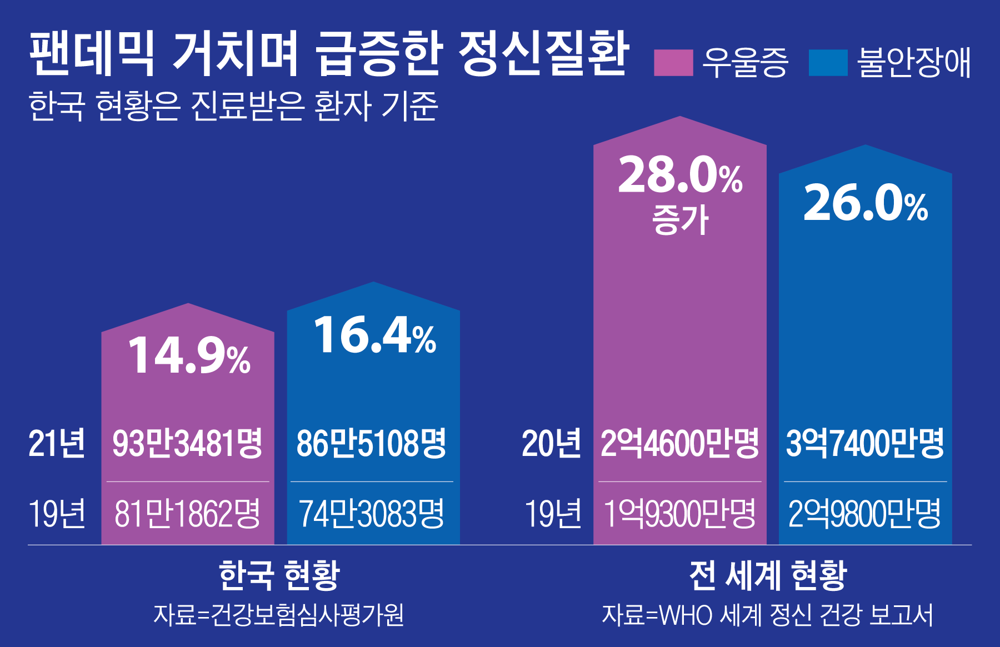
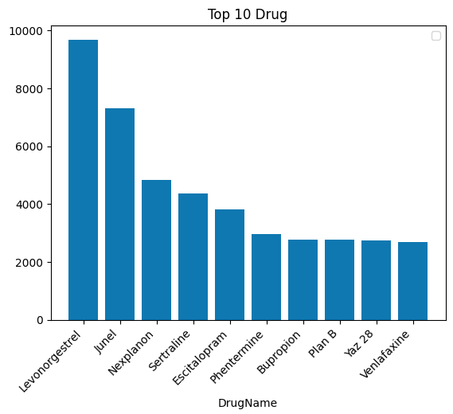
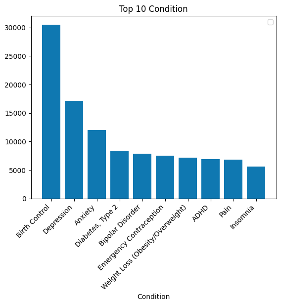
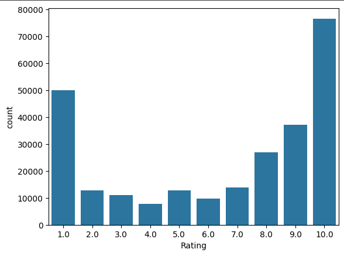
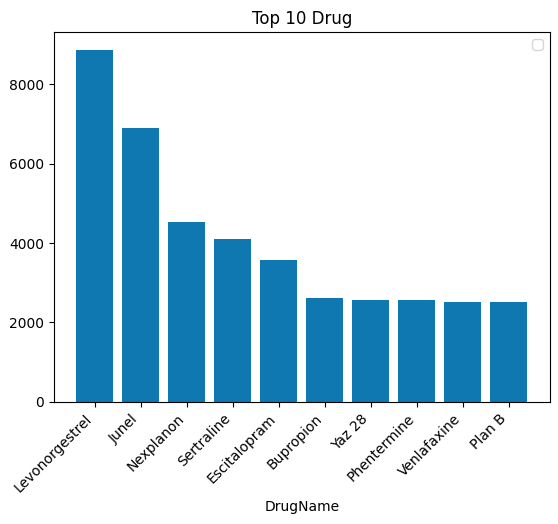
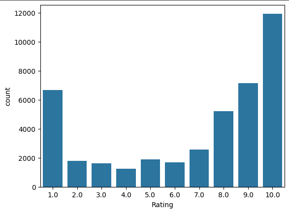
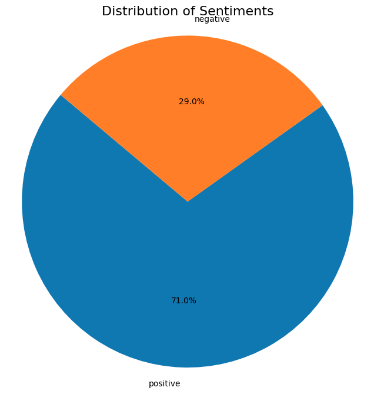

## MobileBert를 활용한 질병 별 약품 사용자 리뷰 감성분석 프로젝트

## 1. 개요 

### 1.1 문제정의
정신 질환에 대한 관심이 대두되는 요즘 늘어난 관심도에 비례해 정신 질환자의 수도 점점 늘어나고 있다.
2020년 전세계를 강타한 코로나 팬데믹 이후 이러한 추세는 더욱 강화되고 있는데[[1]](https://www.chosun.com/economy/weeklybiz/2022/10/13/RJ6RRGN5Q5CNZLTIZSBUQT7Y64/)
기존 정신질환을 가지고 있던 사람들은 제 때 치료를 받지못해 더욱 심화되는 문제에 직면하게 되었다.

세계보건기구에서는 전세계 약 10억명 정도는 정신 장애를 앓고 있다고 추정했으며 이는 2020년 펜데믹 첫 해에 비해 25%가 증가헀다고 밝혔다.
이를 보고 몇몇은 코로나 펜데믹에 이은 정신질환 펜데믹의 등장이다라는 의견을 제시하였다. 

[[2]](https://www.newspim.com/news/view/20231010001078)
한국에서도 위 기사를 보면 알 수 있듯, 우울증을 앓는 공무원들이 눈에띄게 증가되었고 이 뿐만 아니라 2030세대, 더 나아가 청소년의 정신질환율도 눈에띄게 상승되었음을 알 수 있다.

### 1.2 약물치료의 효과
보통의 사람들은 정신질환이라 함은 우울증, 공황장애 등과 같은 질환들을 생각한다.
이와 같은 이유로 사람들의 정신치료에 대한 인식은 심리상담 또는 행동치료가 큰 비중을 차지한다.
이는 물론 외부에서 스트레스를 받아 생기는 우울증, 공황장애에는 효과적일 수 있다.
하지만 조울증, 조현병과 같은 뇌의 문제는 약물치료가 수반되어야만 증세가 호전된다.
[[3]](https://news.amc.seoul.kr/news/con/detail.do?cntId=1358)
[[4]](https://health.chosun.com/site/data/html_dir/2024/01/12/2024011202319.html)
위 참고와 기사에서도 나왔듯, 사람들의 약물치료에 대한 생각은 부정적이지만, 조울증 또는 조현병과 같은 뇌의 문제가
있는 정신질환일수록 약물치료의 중요성이 커지는 것을 알 수 있다.

## 2. 데이터

### 2.1 원시 데이터

[Drugs & Conditions: Patient Voices 데이터셋](https://www.kaggle.com/datasets/mukeshdevrath007/drugs-and-conditions-patient-voices-2-8l?rvi=1)

- 데이터명

  
|Drug Name|Condition|User|Date|Rating|Content|
|--------|--------|--------|------|------|----|
|약물 이름|질환|사용자|작성일|평점|리뷰|

- 데이터 예시

|Drug Name|Condition|User|Date|Rating|Content|
|--------|--------|--------|------|------|----|
|Abilify|Bipolar Disorder	|Jay|9-Jun-20|8|"I just started this Abilify at a 5mg dose and...|
|Abilify|Bipolar Disorder|Andrea|24-Aug-20|8|"I've been struggling with bipolar II my whole...|
|Abilify|Bipolar Disorder|Ben|14-Dec-19	|10|"Been on every BiPolar med known. Finally tri...|
|...|...|...|...|...|...|
|60-Second Fluoride Foam|Prevention of Dental Caries|Kurt|13-Mar-15|9|"Using in trays post-radiation, easier to fill...|
|60-Second Fluoride Foam|Prevention of Dental Caries|Holly|26-Oct-20|8|Denta 5000 Plus (fluoride)"I'm wondering if it...|

데이터는 총 280012건이며 평점은 1-10점으로 이루어져있다.

- 데이터 부가정보
  
**약물 종류**

~~~
num = len(data['Drug Name'].unique())
print('약물종류:',num,'개')
~~~

`약물종류: 1022 개`

데이터의 총 약물 종류는 1022개이다.

**상위 10개 약물**

|순위|약물명| 목적  |
|-|--------|--------|
|1|Levonorgestrel|응급 피임약|
|2|Junel|경구 피임약|
|3|Nexplanon|여성 피임 임플란트|
|4|Sertraline|항우울제|
|5|Escitalopram|항우울제|
|6|Phentermine|식욕 억제제|
|7|Bupropion|항우울제|
|8|Plan B|긴급 피임약|
|9|Yaz 28|경구 피임약|
|10|Venlafaxine|항우울제|

데이터의 구성을 알아보기 위해 상위 10개 약물과 그 목적을 막대그래프로 그려 표현하였다.
주로 피임 목적의 약과 항우울제의 리뷰가 상위에 분포해있음을 알 수 있다.

**상위 10개 질환**

|순위|질환명||
|-|--------|--------|
|1|Birth Control|피임|
|2|Depression|우울증|
|3|Anxiety|불안장애|
|4|Diabetes, Type 2|제 2형 당뇨병|
|5|Bipolar Disorder|조울증|
|6|Emergency Contraception|긴급 피임|
|7|Weight Loss (Obesity/Overweight)|체중감소(비만/과체중)|
|8|ADHD|주의력결핍 과잉행동장애|
|9|Pain|통증|
|10|Insomnia|불면증|

리뷰가 많은 상위 10개의 질환을 그래프에서 나타냈을 때, 위 상위 10개의 약물과 관계가 있는 질환(피임, 정신장애)들이 대부분을 차지한 것으로 나타났으며 이는 위 두 그래프의 결과가 상관관계에 있다고 할 수 있다.

**평점 분포**

위 그래프는 데이터의 평점 분포를 그래프로 표현한 것이다.
그래프를 살펴봤을 때 10점과 1점이 가장 많은 것을 알 수 있고, 긍정적인 평이 더 많은 것을 알 수있다.

### 2.3 추출 데이터
이 프로젝트에선 데이터 시각화를 통해 유의미한 데이터라고 판단된 정신질환과 관련된 데이터를 추출하고자 했다.
위 데이터셋의 정신질환 중 사람들에게 대중적인 5가지의 질환을 선정하였고 선정된 정신질환은 아래 5가지의 질환이다.

|질환|  |
|---|---|
|ADHD|주의력결핍 과잉행동장애|
|Depression|우울증|
|Anxiety|불안|
|Post Traumatic Stress DisorderOff-label|외상 후 스트레스(PTSD)|
|Bipolar Disorder|양극성 장애|

총 추출 데이터는 44420건이며, 총 약물 종류는 96개 이다.

#### 추출데이터 분석

**상위 10개 약물**

|순위|약물명| 목적  |
|-|--------|--------|
|1|Levonorgestrel|응급 피임약|
|2|Junel|경구 피임약|
|3|Nexplanon|여성 피임 임플란트|
|4|Sertraline|항우울제|
|5|Escitalopram|항우울제|
|6|Bupropion|항우울제|
|7|Yaz 28|경구 피임약|
|8|Phentermine|식욕 억제제|
|9|Venlafaxine|항우울제|
|10|Plan B|긴급 피임약|

추출 데이터의 상위 10가지 약물에 대한 그래프이다.
위 그래프의 10가지 약물 모두 기존 데이터의 상위 10가지 약물과 동일하며, 순위만 조금씩 변동된 모습을 알 수 있다.

**평점 분포**

추출 데이터의 평점 분포 그래프이다. 평점 분포또한 기존 데이터의 그래프와 큰 차이는 없지만, 긍정적 리뷰가 더 증가하였음을 알 수 있다.

**리뷰 길이**

추출 데이터의 리뷰 글자 수 분포 그래프이다. 유의미한 데이터만을 보기 위해 0-3000자까지 있던 기존 데이터 구간을 2000자로 제한해
그래프로 표현하였다. 이후 그래프를 살펴 본 결과 700-800자 사이의 분포가 가장 많음을 알 수 있다.

## 3. 학습데이터

### 3.1 리뷰의 긍부정 분류

이 프로젝트에선 1-10점 사이의 평점에서 3점 이하를 부정, 8점이상을 긍정 데이터로 지정하였으며, 나머지 데이터는 중립 데이터로써 
설정하였다.
위 원그래프는 학습에 혼란을 줄 수 있는 중립 데이터를 삭제한 후, 긍 부정 비율을 한 눈에 알아볼 수 있도록 만든 그래프이며 
이를 통해 데이터셋의 긍정 비율이 약 70% 부정 비율이 약 30%를 차지하고 있음을 알 수 있다.

### 3.2 학습 데이터 구축

기존 추출 데이터인 44420건에서 학습 데이터를 구축하기 위해 긍정(1)과 부정(0)으로 데이터를 나누었고 유의미한 학습을 위해 
리뷰 글자 수가 가장 많이 분포해있던 200-800자 사이의 데이터를 추출해, 학습 데이터를 구축하고자 하였다.

|Content|RatingClass|
|--------|--------|
|"I just started this Abilify at a 5mg dose and..."|1|
|"Been on every BiPolar med known. Finally tri...	"|1|
|"I feel like a new woman on Abilify! I have Bi..."|1|
|...|...|
|"5-HTP (5-hydroxytryptophan)"Well I had high ho..."|0|
|"5-HTP (5-hydroxytryptophan)"It made me feel mu..."|0|
|""Don't use the instant release unless u want t..."|0|

위 전처리를 거친 학습데이터는 총 28358건의 데이터이며 Content 열과 RatingClass 열만을 추출해 새로운 데이터 프레임을 만들었다.

|Content|RatingClass|
|--------|--------|
|"Ever since my 1st panic attack almost 3 years..."|1|
|"OMG!!! This is working I can't believe this a..."|1|
|...|...|
|"BuSpar (buspirone)"I initially was prescribed ..."|0|
|"Was extremely sedative, resulting in me sleep..."|0|

이후, 기존 추출 데이터의 긍 부정비율에 맞추어 7:3비율로 총 3000건의 샘플데이터를 추출하였다.

## 4. 결과

### 4.1 MobileBert 사용 결과

## 5. 결론
