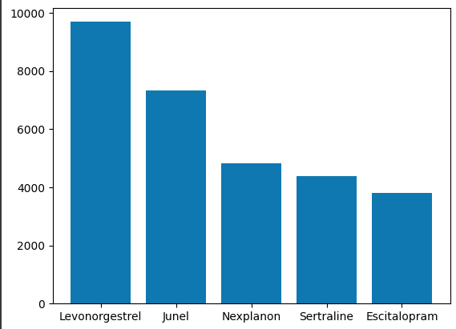
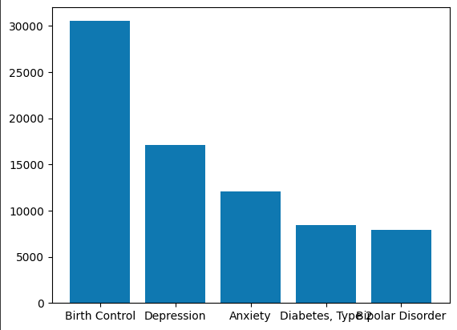
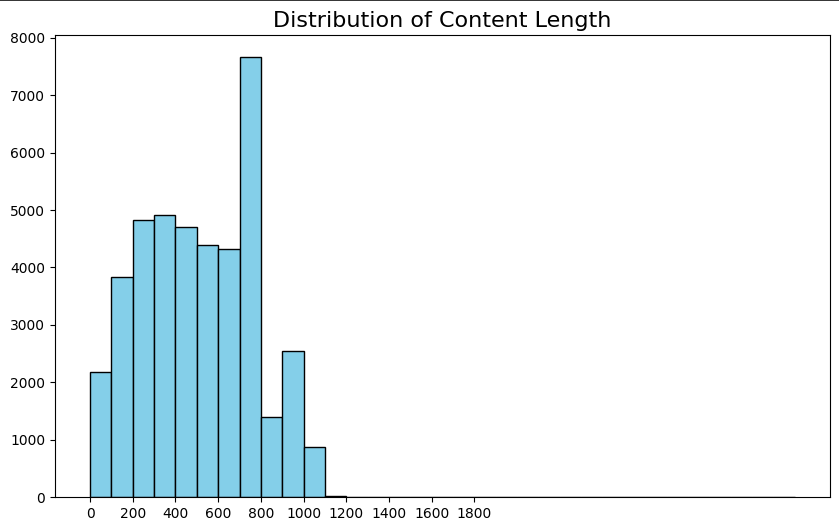
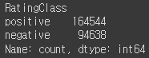
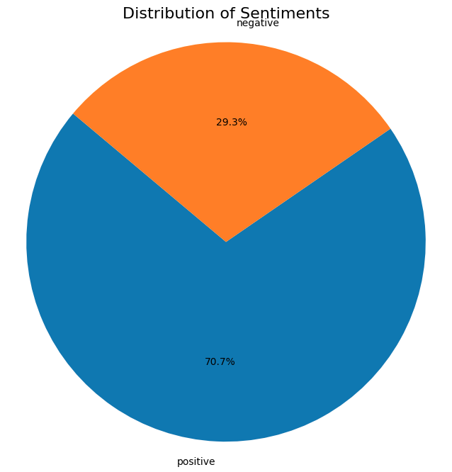

## MobileBert를 활용한 질병 별 약품 사용자 리뷰 감성분석 프로젝트

## 1. 개요 

### 1.1 문제정의
정신 질환에 대한 관심이 대두되는 요즘 늘어난 관심도에 비례해 정신 질환자의 수도 점점 늘어나고 있다. 
2020년 전세계를 강타한 코로나 팬데믹 이후 이러한 추세는 더욱 강화되고 있는데[[1]](https://www.chosun.com/economy/weeklybiz/2022/10/13/RJ6RRGN5Q5CNZLTIZSBUQT7Y64/)
기존 정신질환을 가지고 있던 사람들은 제 때 치료를 받지못해 더욱 심화되는 문제에 직면하게 되었다. 

세계보건기구에서는 전세계 약 10억명 정도는 정신 장애를 앓고 있다고 추정했으며 이는 2020년 펜데믹 첫 해에 비해 25%가 증가헀다고 밝혔다.
이를 보고 몇몇은 코로나 펜데믹에 이은 정신질환 펜데믹의 등장이다라는 의견을 제시하였다. 

[[2]](https://www.newspim.com/news/view/20231010001078)
한국에서도 위 기사를 보면 알 수 있듯, 우울증을 앓는 공무원들이 눈에띄게 증가되었고 이 뿐만 아니라 2030세대, 더 나아가 청소년의 정신질환율도 눈에띄게 상승되었음을 알 수 있다.

### 1.2 약물치료의 효과
보통의 사람들은 정신질환이라 함은 우울증, 공황장애 등과 같은 질환들을 생각한다.
이와 같은 이유로 사람들의 정신치료에 대한 인식은 심리상담 또는 행동치료가 큰 비중을 차지한다. 
이는 물론 외부에서 스트레스를 받아 생기는 우울증, 공황장애에는 효과적일 수 있다.
하지만 조울증, 조현병과 같은 뇌의 문제는 약물치료가 수반되어야만 증세가 호전된다.
[[3]](https://news.amc.seoul.kr/news/con/detail.do?cntId=1358)
[[4]](https://health.chosun.com/site/data/html_dir/2024/01/12/2024011202319.html) 
위 참고와 기사에서도 나왔듯, 사람들의 약물치료에 대한 생각은 부정적이지만, 조울증 또는 조현병과 같은 뇌의 문제가
있는 정신질환일수록 약물치료의 중요성이 커지는 것을 알 수 있다.

## 2. 데이터

### 2.1 원시 데이터

[Drugs & Conditions: Patient Voices 데이터셋](https://www.kaggle.com/datasets/mukeshdevrath007/drugs-and-conditions-patient-voices-2-8l?rvi=1)

- 데이터명

  
|Drug Name|Condition|User|Date|Rating|Content|
|---------|---------|----|----|------|-------|
| 의약품 명 | 질병 | 사용자 | 날짜 | 평점 | 리뷰 |
- 데이터 예시

  
|Drug Name|Condition|User|Date|Rating|Content|
|---------|---------|----|----|------|-------|
| Abilify | Bipolar Disorder | Jay | 9-Jun-20 | 8 | "I just started this Abilify at a 5mg dose and am going up to 10 mg today. Side effects were - nause... |
| Abilify | Bipolar Disorder | Andrea | 24-Aug-20 | 8 | "I've been struggling with bipolar II my whole life and have been hospitalized twice. This last time... |
|...|...|...|...|...|...|
| Zyvox | Methicillin-Resistant Staphylococcus Aureus Infection | Anonymous | 29-Jul-12 | 10 | "I had a MRSA staph infection when I was 14. I had almost died from the infection and due to my hear... |

데이터는 총 280011 건이며 평점은 총 1-10 점으로 구성되어있다.

### 2.2 데이터 분석
**약물 개수**
~~~
num = len(data['Drug Name'].unique())
print('약물종류:',num,'개')
~~~
`약물종류: 1022 개`
총 약물 종류는 1022개이다.

**상위 5개 약물**

 

리뷰가 많은 싱위 5개의 약물 그래프이다. 

|순위|약물|목적|
|------|---|---|
|1|Levonorgestrel|응급 피임약|
|2|Junel|경구 피임약|
|3|Nexplanon|가역성 피임약|
|4|Sertraline|항우울제|
|5|Escitalopram|항우울제|

위 그래프와 표를 보면 피임약, 항우울제가 가장 많은 리뷰를 가지고있음을 알 수 있다.

**상위 5개 질환**

 

리뷰가 많은 상위 5개 질환 그래프이다. 

|순위|질환|  |
|------|---|---|
|1|Birth Control|피임|
|2|Depression|우울증|
|3|Anxiety|불안|
|4|Diabetes, Type 2|당뇨병 2유형|
|5|Bipolar Disorder|양극성 장애|

상위 5개의 질환을 보면 위 5개 약물의 목적과 대부분 큰 관련이 있는 모습을 보인다.

즉, 상위 5개의 질환과 약물 사이에는 상관관계가 있음을 알 수 있다.

**평점 분포**

 

1 - 10점으로 이뤄진 평점을 그래프로 표현하였다. 
10(최상)점과 1(최하)점이 1,2순위를 이루고 있고 긍정적 평이 더 많은 것을 알 수 있다.

**리뷰 글자 수**

 

약에 대한 사용자들의 리뷰 글자 수를 보여주는 그래프이다. 
0-10000자까지 분포해있고 0-1000자 사이에 가장 많이 분포해있음을 알 수 있다.

**긍 부정 분류**

이 프로젝트에선 5점 이하를 부정데이터, 6점 이상을 긍정데이터로 잡아 분석을 진행하였다. 

~~~
data['rating'] = data['rating'].apply(lambda x: "negative" if x=<5.0
                                      else "positive")
~~~
  
분류 후 각각의 수치를 살펴보면  

긍정데이터가 약 16만건, 부정데이터가 약 9만건이 있음을 알 수 있다.

이후 보기쉽게 원 그래프를 활용해 수치를 표현해보면

 

긍정데이터가 전체 데이터의 63.5%, 부정데이터는 36.5%를 차지하고 있음을 알 수 있다.

### 2.3 추출 데이터

이 프로젝트에선 전체 데이터셋에서 대중적인 정신질환 5가지를 선정해 감성분석을 진행하고자 하였다.

선정된 정신질환은 아래 5가지의 질환이다.

|질환|  |
|---|---|
|Schizophrenia|조현병|
|Depression|우울증|
|Anxiety|불안|
|Post Traumatic Stress DisorderOff-label|외상 후 스트레스(PTSD)|
|Bipolar Disorder|양극성 장애|

