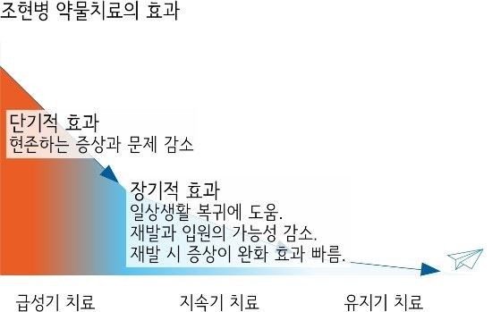

## MobileBert를 활용한 질병 별 약품 사용자 리뷰 감성분석 프로젝트

## 1. 개요 

### 1.1 문제정의
정신 질환에 대한 관심이 대두되는 요즘 늘어난 관심도에 비례해 정신 질환자의 수도 점점 늘어나고 있다. 
2020년 전세계를 강타한 코로나 팬데믹 이후 이러한 추세는 더욱 강화되고 있는데 [1.참고](https://www.chosun.com/economy/weeklybiz/2022/10/13/RJ6RRGN5Q5CNZLTIZSBUQT7Y64/)
사회적 거리두기, 가족 또는 지인의 사망 그리고 사람들이 병원 방문을 꺼리기 시작하며 정신질환이 없던 사람들은 정신질환을 앓게 되었고
기존 정신질환을 가지고 있던 사람들은 제 때 치료를 받지못해 더욱 심화되는 문제에 직면하게 되었다. 

세계보건기구에서는 전세계 약 10억명 정도는 정신 장애를 앓고 있다고 추정했으며 이는 2020년 펜데믹 첫 해에 비해 25%가 증가헀다고 밝혔다.
이를 보고 몇몇은 코로나 펜데믹에 이은 정신질환 펜데믹의 등장이다라는 의견을 제시하였다. 

[1.기사](https://www.newspim.com/news/view/20231010001078)
한국에서도 위 기사를 보면 알 수 있듯, 우울증을 앓는 공무원들이 눈에띄게 증가되었고 이 뿐만 아니라 2030세대, 더 나아가 청소년의 정신질환율도 눈에띄게 상승되었음을 알 수 있다.

### 1.2 약물치료의 효과
보통의 사람들은 정신질환이라 함은 우울증, 공황장애 등과 같은 질환들을 생각한다.
이와 같은 이유로 사람들의 정신치료에 대한 인식은 심리상담 또는 행동치료가 큰 비중을 차지한다. 
이는 물론 외부에서 스트레스를 받아 생기는 우울증, 공황장애에는 효과적일 수 있다.
하지만 조울증, 조현병과 같은 뇌의 문제는 약물치료가 수반되어야만 증세가 호전된다. 
[2.참고](https://news.amc.seoul.kr/news/con/detail.do?cntId=1358)
[2.기사](https://health.chosun.com/site/data/html_dir/2024/01/12/2024011202319.html) 
위 참고와 기사에서도 나왔듯, 사람들의 약물치료에 대한 생각은 부정적이지만, 조울증 또는 조현병과 같은 뇌의 문제가
있는 정신질환일수록 약물치료의 중요성이 커지는 것을 알 수 있다.

## 2. 데이터

### 2.1 원시 데이터

[Drugs & Conditions: Patient Voices 데이터셋](https://www.kaggle.com/datasets/mukeshdevrath007/drugs-and-conditions-patient-voices-2-8l?rvi=1)

- 데이터명

  
|Drug Name|Condition|User|Date|Rating|Content|
|---------|---------|----|----|------|-------|
| 의약품 명 | 질병 | 사용자 | 날짜 | 평점 | 리뷰 |
- 데이터 예시

  
|Drug Name|Condition|User|Date|Rating|Content|
|---------|---------|----|----|------|-------|
| Abilify | Bipolar Disorder | Jay | 9-Jun-20 | 8 | "I just started this Abilify at a 5mg dose and am going up to 10 mg today. Side effects were - nause... |
| Abilify | Bipolar Disorder | Andrea | 24-Aug-20 | 8 | "I've been struggling with bipolar II my whole life and have been hospitalized twice. This last time... |
|...|...|...|...|...|...|
| Zyvox | Methicillin-Resistant Staphylococcus Aureus Infection | Anonymous | 29-Jul-12 | 10 | "I had a MRSA staph infection when I was 14. I had almost died from the infection and due to my hear... |

데이터는 총 280011 건이며 평점은 총 1-10 점으로 구성되어있다.

### 2.2 데이터 분석

### 2.3 추출 데이터

